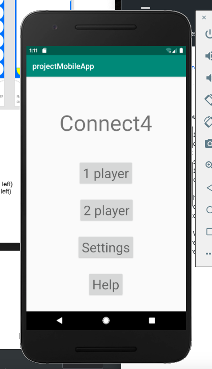
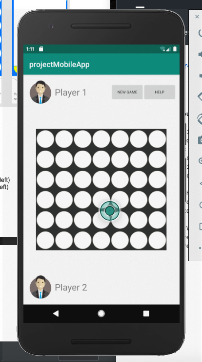

# Connect-Four-MobileApp

<h3>Description:</h3>
<ul>
<li>
Connect Four is a two-player connection game in which players take turns dropping one colored disc from the top into a seven-column, six-row vertically suspended grid. The pieces fall straight down to thee lowest available space within the column. The objective of the game is to be the first to form a horizontal, vertical, or diagonal line of four adjacent discs.
</li></ul>
 
<h3>Rules:</h3>
<ul>
  <li>
To win, you must be the first player to get four of your colored checkers in a row either horizontally, vertically or diagonally.
</li></ul>
 
<h3>Display View</h3>
<ul>
  <li>
<h4>Main Screen:</h4>
    
  </li>
  <li>
<h4>Game Screen</h4>
    
  </li>
